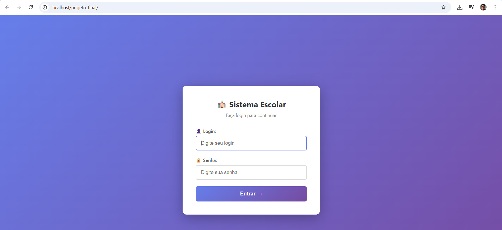
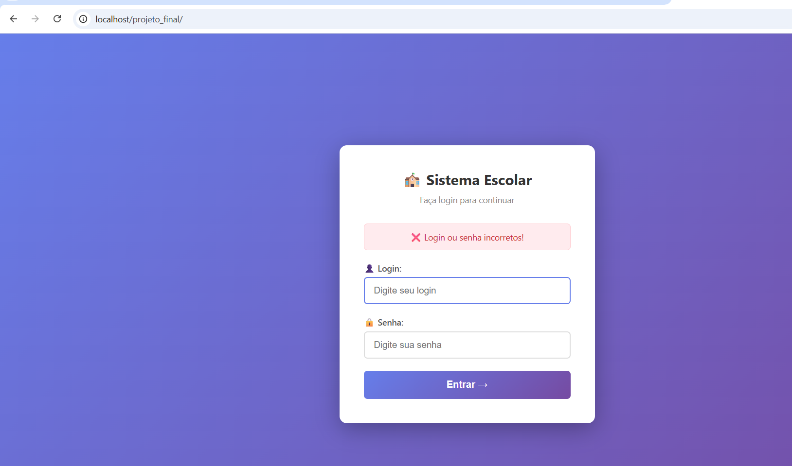
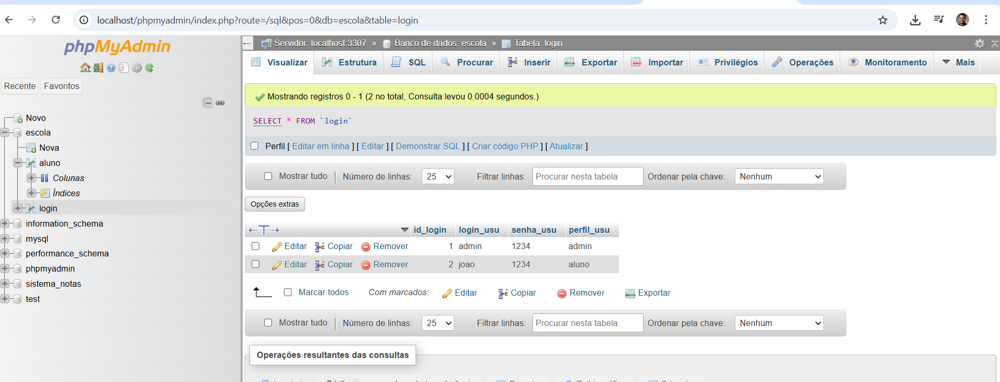
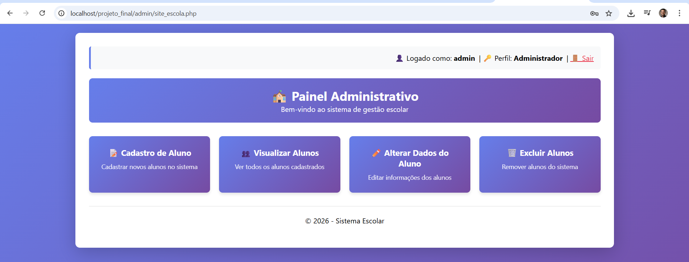

<h1 align="center">🏫 Sistema Escolar — PHP + MySQL</h1>

<p align="center">
  Sistema web de gerenciamento escolar com autenticação por perfil, desenvolvido em PHP puro com MySQL.
</p>

<p align="center">
  
  
  
  
</p>

---

## 📸 Screenshots

<div align="center">

| Tela de Login | Erro de Autenticação |
|:---:|:---:|
|  |  |

| Banco de Dados | Painel Administrativo |
|:---:|:---:|
|  |  |

</div>

---

## ✨ Funcionalidades

### 👑 Administrador
- ✅ Login com autenticação por sessão PHP
- ✅ Cadastro de novos alunos
- ✅ Listagem completa de alunos
- ✅ Edição de dados dos alunos
- ✅ Exclusão de alunos (com confirmação)
- ✅ Logout seguro com destruição de sessão

### 🎓 Aluno
- ✅ Login com perfil restrito
- ✅ Visualização da lista de alunos matriculados

---

## 🗂️ Estrutura do Projeto

```
projeto_final/
│
├── 📄 index.php              # Tela de login (ponto de entrada)
├── 📄 conexao.php            # Configuração da conexão com o banco
├── 📄 logout.php             # Encerra a sessão do usuário
├── 🎨 style.css              # Estilos globais compartilhados
│
├── 📁 admin/
│   ├── site_escola.php       # Painel administrativo (menu principal)
│   ├── formulario_aluno.php  # Formulário de cadastro de aluno
│   ├── recebe.php            # Processa e insere o cadastro no banco
│   ├── lista_alunos.php      # Lista todos os alunos cadastrados
│   ├── editar_aluno.php      # Formulário de edição de dados
│   └── excluir_aluno.php     # Remove um aluno do banco
│
├── 📁 aluno/
│   └── index.php             # Área do aluno (somente leitura)
│
└── 📁 prints/                # Screenshots do projeto
```

---

## 🗄️ Banco de Dados

**Banco:** `escola` &nbsp;|&nbsp; **Porta:** `3307` (padrão XAMPP customizado)

### Tabela `login`
| Campo | Tipo | Descrição |
|---|---|---|
| `id_login` | INT — PK, AI | Identificador único |
| `login_usu` | VARCHAR(50) | Nome de usuário |
| `senha_usu` | VARCHAR(100) | Senha do usuário |
| `perfil_usu` | VARCHAR(10) | Perfil: `admin` ou `aluno` |

### Tabela `aluno`
| Campo | Tipo | Descrição |
|---|---|---|
| `id_alu` | INT — PK, AI | Identificador único |
| `nome_alu` | VARCHAR(100) | Nome completo |
| `cidade_alu` | VARCHAR(100) | Cidade |
| `tel_alu` | VARCHAR(20) | Telefone |
| `sexo_al` | VARCHAR(15) | Sexo |
| `email_alu` | VARCHAR(100) | E-mail |

### 📋 SQL para criar o banco

```sql
CREATE DATABASE IF NOT EXISTS escola;
USE escola;

CREATE TABLE login (
  id_login   INT AUTO_INCREMENT PRIMARY KEY,
  login_usu  VARCHAR(50)  NOT NULL,
  senha_usu  VARCHAR(100) NOT NULL,
  perfil_usu VARCHAR(10)  NOT NULL
);

CREATE TABLE aluno (
  id_alu     INT AUTO_INCREMENT PRIMARY KEY,
  nome_alu   VARCHAR(100) NOT NULL,
  cidade_alu VARCHAR(100),
  tel_alu    VARCHAR(20),
  sexo_al    VARCHAR(15),
  email_alu  VARCHAR(100)
);

-- Usuários de exemplo
INSERT INTO login (login_usu, senha_usu, perfil_usu) VALUES
  ('admin', '1234', 'admin'),
  ('joao',  '1234', 'aluno');
```

---

## 🚀 Como Rodar Localmente

### Pré-requisitos
- PHP 7.4 ou superior
- MySQL / MariaDB
- XAMPP, WAMP ou servidor Apache

### Passo a passo

**1. Clone o repositório:**
```bash
git clone https://github.com/cientistaarlis/sistema-escolar-php.git
```

**2. Mova para a pasta do servidor:**
- XAMPP → `C:/xampp/htdocs/`
- WAMP → `C:/wamp/www/`

**3. Crie o banco de dados:**

Acesse o phpMyAdmin e execute o SQL acima, ou via terminal:
```bash
mysql -u root -p < banco.sql
```

**4. Configure a conexão em `conexao.php`:**
```php
$host    = "localhost";
$porta   = "3306";   // ajuste conforme seu ambiente
$usuario = "root";
$senha   = "";       // sua senha do MySQL
$banco   = "escola";
```

**5. Acesse no navegador:**
```
http://localhost/sistema-escolar-php/
```

---

## 🔐 Credenciais de Teste

| Usuário | Senha | Perfil |
|:---:|:---:|:---:|
| `admin` | `1234` | 👑 Administrador |
| `joao` | `1234` | 🎓 Aluno |

---

## 🛠️ Tecnologias Utilizadas

| Tecnologia | Uso |
|---|---|
| **PHP** | Lógica do servidor, sessões, prepared statements |
| **MySQL** | Banco de dados relacional |
| **HTML5** | Estrutura das páginas |
| **CSS3** | Interface responsiva com gradientes e animações |
| **phpMyAdmin** | Gerenciamento visual do banco |

---

## ⚠️ Aviso de Segurança

Este projeto foi desenvolvido com fins **didáticos**. Para uso em produção, recomenda-se:

- 🔐 Usar `password_hash()` e `password_verify()` para as senhas
- 🛡️ Adicionar proteção contra CSRF
- 🚫 Nunca expor credenciais do banco em repositórios públicos
- ✅ Manter o PHP e o MySQL sempre atualizados

---

## 📄 Licença

Este projeto é de uso **acadêmico e educacional**.  
Sinta-se à vontade para usar como base de estudo.

---

<p align="center">
  Desenvolvido com 💜 por <a href="https://github.com/cientistaarlis">cientistaarlis</a>
</p>
